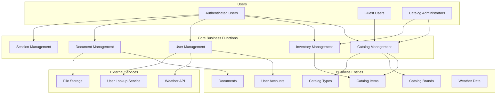

# Business Logic Summary: eShop Legacy MVC Application

## Executive Summary

The eShop Legacy MVC application is a **product catalog management system** designed for businesses that need to manage and display their product inventory. It serves retail businesses, catalog administrators, and end users who need to browse, manage, and interact with product catalogs. The application solves the fundamental business problem of **centralized product catalog management** with built-in inventory tracking, user authentication, and document management capabilities.

The system enables businesses to:
- Maintain a centralized product catalog with detailed information and images
- Track inventory levels and manage restocking thresholds
- Provide secure access control for different user types
- Manage business documents and files
- Monitor user sessions and system information

## High-Level Business Diagram

## Core Business Entities

### Catalog Item
The central business entity representing products in the catalog. Contains:
- **Product Information**: Name, description, price, picture
- **Categorization**: Brand and type classifications  
- **Inventory Management**: Available stock, restock thresholds, maximum stock levels
- **Status Tracking**: On reorder flag

### Catalog Brand
Represents product manufacturers or brands (e.g., ".NET Foundation", "Microsoft"). Used to categorize and filter products by their brand identity.

### Catalog Type  
Represents product categories or types (e.g., "Mug", "T-Shirt", "Sheet", "USB Memory Stick"). Used to organize products by their functional category.

### User Account
Represents system users with authentication credentials and profile information, including integration with external user lookup services for additional data like zip codes.

### Documents
Business files that can be uploaded, stored, and retrieved by authorized users for operational purposes.

### Session Data
Temporary user session information for maintaining application state and demonstrating session management capabilities.

## Business Processes

### Catalog Management Process
- **Purpose**: Maintain and organize the product catalog
- **Trigger**: Administrator needs to add, edit, or remove products
- **Steps**: 
  1. Administrator accesses catalog management interface
  2. Creates/edits product with required information (name, price, brand, type)
  3. Sets inventory parameters (stock levels, thresholds)
  4. Associates product images and descriptions
  5. System validates business rules and saves changes
- **Outcome**: Updated product catalog available to all users

### Inventory Management Process
- **Purpose**: Track and manage product stock levels
- **Trigger**: Stock level changes or reorder conditions met
- **Steps**:
  1. System tracks available stock for each product
  2. Monitors stock against restock threshold
  3. Flags items for reorder when threshold reached
  4. Enforces maximum stock limits for warehouse constraints
  5. Updates inventory status across the system
- **Outcome**: Optimized inventory levels and automated reorder notifications

### User Authentication Process
- **Purpose**: Secure system access and user management
- **Trigger**: User attempts to log in or register
- **Steps**:
  1. User provides email and password credentials
  2. System validates against stored user accounts
  3. Creates secure session for authenticated users
  4. Provides role-based access to system features
  5. Integrates with external services for additional user data
- **Outcome**: Secure, authenticated user session with appropriate access rights

### Document Management Process
- **Purpose**: Handle business document storage and retrieval
- **Trigger**: User needs to upload, download, or manage documents
- **Steps**:
  1. User selects document for upload through web interface
  2. System authenticates user permissions
  3. File is stored in configured network location
  4. Document metadata is tracked for retrieval
  5. Users can browse and download available documents
- **Outcome**: Centralized document repository with secure access

### Session Management Process
- **Purpose**: Demonstrate session state persistence and management capabilities
- **Trigger**: User accesses session demo functionality
- **Steps**:
  1. User navigates to session management interface
  2. Current session data displayed (integer and string items)
  3. User can modify session values through web form
  4. System updates session state and persists across requests
  5. Footer displays machine name and session start time for tracking
- **Outcome**: Demonstrates session persistence and state management for business applications

### API Integration Process  
- **Purpose**: Provide programmatic access to catalog data for external systems
- **Trigger**: External system requests catalog information via REST API
- **Steps**:
  1. API request received for catalog brands or files
  2. System authenticates request and validates parameters
  3. Business logic retrieves requested data from catalog service
  4. Data formatted as JSON or binary serialization
  5. Response returned with appropriate HTTP status codes
- **Outcome**: Enables third-party integrations and data exchange capabilities

### Pagination and Display Process
- **Purpose**: Efficiently display large product catalogs
- **Trigger**: User browses catalog or requests specific page
- **Steps**:
  1. System retrieves total count of available products
  2. Calculates pagination parameters (page size, total pages)
  3. Retrieves specific subset of products for current page
  4. Displays products with navigation controls
  5. Allows user to navigate between pages
- **Outcome**: User-friendly browsing experience for large catalogs

## Business Rules and Validations

### Product Validation Rules
- **Product Name**: Required field, cannot be empty
- **Price**: Must be positive number with maximum 2 decimal places, range 0-1,000,000, specified as currency data type
- **Available Stock**: Must be between 0 and 10 million (warehouse capacity constraints)
- **Restock Threshold**: Must be between 0 and 10 million (when to trigger reorders)
- **Maximum Stock Threshold**: Must be between 0 and 10 million (physical warehouse limits)
- **Brand and Type**: Must reference valid existing brands and types from dropdown lists
- **Picture**: Defaults to "dummy.png" placeholder if not provided, read-only during editing
- **OnReorder Flag**: Boolean indicator for items needing restocking

### User Account Rules
- **Email**: Must be unique and valid email format
- **Password**: Minimum 6 characters, requires uppercase, lowercase, digit, and special character
- **Account Lockout**: Maximum 5 failed login attempts before 5-minute lockout
- **Session Security**: 30-minute validation interval for security token refresh

### Inventory Management Rules
- **Restock Threshold**: When available stock falls below threshold, item flagged for reorder
- **Maximum Stock**: Physical warehouse constraints limit maximum stock levels
- **Stock Validation**: All stock values must be non-negative integers

### File Management Rules
- **Access Control**: File operations require user authentication and proper authorization
- **Storage Location**: Configurable network path with service account impersonation for security
- **File Handling**: Support for multiple file uploads with proper MIME type detection and validation
- **Performance Optimization**: Caching enabled for file downloads with maximum duration for static content
- **Image Management**: Product images served through dedicated controller with fallback to default placeholder

## User Roles and Capabilities

### Guest Users (Unauthenticated)
- **View Catalog**: Browse products with pagination
- **View Product Details**: Access detailed product information
- **Access Registration**: Create new user accounts

### Authenticated Users
- **All Guest Capabilities**: Plus authenticated features
- **User Profile**: Access personal information and external data (zip code, weather)
- **Session Management**: Interact with session demonstration features
- **Document Access**: View and download available documents

### Catalog Administrators (Authenticated Users with Admin Rights)
- **All User Capabilities**: Plus administrative functions
- **Catalog Management**: Create, edit, and delete products through web interface
- **Inventory Control**: Manage stock levels and reorder settings
- **Document Management**: Upload and manage business documents
- **Brand/Type Management**: Maintain product categorization system
- **API Access**: Programmatic access to catalog data via REST endpoints
- **Data Export**: Access to binary serialization of catalog data for integration purposes

## Decision Logic

### Inventory Reorder Decision
- **Criteria**: Available stock <= Restock threshold
- **Action**: Set OnReorder flag to true
- **Business Impact**: Triggers purchasing workflow for inventory replenishment

### Stock Limit Enforcement
- **Criteria**: Requested stock > Maximum stock threshold  
- **Action**: Prevent stock increase beyond limit
- **Business Impact**: Maintains warehouse capacity constraints

### User Authentication Decision
- **Criteria**: Valid email/password combination
- **Action**: Grant system access with appropriate role permissions
- **Business Impact**: Secure system access with role-based functionality

### File Access Authorization
- **Criteria**: User authentication status and file permissions
- **Action**: Allow/deny file operations
- **Business Impact**: Secure document management with access control

### Data Source Selection
- **Criteria**: Configuration setting "UseMockData"
- **Action**: Use either database or mock data service
- **Business Impact**: Supports different deployment scenarios (development vs. production)

## External Business Integrations

### Weather API Service
- **Purpose**: Provide location-based weather information to users
- **Integration**: RESTful API calls using user zip code data
- **Business Value**: Enhanced user experience with contextual information

### User Lookup Service
- **Purpose**: Retrieve additional user profile data (zip codes)
- **Integration**: HTTP service calls for user enrichment
- **Business Value**: Extended user profiling capabilities

### File Storage System
- **Purpose**: Network-based document storage and retrieval
- **Integration**: Windows file system with service account impersonation
- **Business Value**: Centralized document management with security

### Message Queue Integration
- **Purpose**: Asynchronous processing of catalog item creation events
- **Integration**: Windows Message Queue (MSMQ) with configured queue path
- **Business Value**: Enables event-driven architecture for new catalog item notifications
- **Implementation**: XML message formatting with CatalogItem data sent to "NewItemQueuePath" configuration setting

### REST API Services
- **Purpose**: Provide programmatic access to catalog data for external system integration
- **Integration**: RESTful Web API endpoints for brands and catalog data export
- **Business Value**: Enables third-party system integration and data synchronization
- **Capabilities**: JSON responses for catalog brands, binary serialization for bulk data transfer, HTTP status code management

## Data Relationships

### Product Hierarchy
- **Catalog Items** belong to one **Catalog Brand** (many-to-one)
- **Catalog Items** belong to one **Catalog Type** (many-to-one)
- **Brands** and **Types** can have multiple **Catalog Items** (one-to-many)

### User Relationships
- **Users** have unique **Email** addresses (one-to-one)
- **Users** can have extended profile data via **User Lookup** (one-to-one)
- **Users** can have multiple **Session** instances (one-to-many)

### Inventory Relationships
- **Catalog Items** have **Stock Levels** (one-to-one)
- **Stock Levels** include **Available**, **Restock Threshold**, and **Maximum** values
- **Reorder Status** is calculated based on current stock vs. threshold

## Key Business Workflows

### End-to-End Product Management Workflow
1. **Administrator Login**: Secure authentication with role verification
2. **Navigate to Catalog**: Access product management interface
3. **Create Product**: Enter product details with business rule validation
4. **Set Inventory**: Configure stock levels and reorder parameters
5. **Assign Categories**: Link to appropriate brand and type using dropdown selectors
6. **Save and Publish**: Make product available in catalog
7. **Message Queue Notification**: System sends new item creation event to message queue
8. **Monitor Stock**: Ongoing inventory level tracking
9. **Reorder Notification**: Automated flagging when restock needed

### Customer Product Discovery Workflow
1. **Access Catalog**: Browse available products (authenticated or guest)
2. **Navigate Pages**: Use pagination to explore full catalog with configurable page sizes
3. **View Details**: Access comprehensive product information including images
4. **Filter by Category**: Use brand/type filters for targeted browsing
5. **Compare Options**: Review multiple products across categories

### Document Management Workflow
1. **User Authentication**: Verify access rights for document operations
2. **Browse Documents**: View available business documents with download links
3. **Upload New Documents**: Add multiple files to central repository via web form
4. **Download Documents**: Retrieve files with proper MIME type detection and security
5. **File Organization**: Maintain organized document structure with caching for performance

### Session Management Workflow
1. **Session Initialization**: System tracks machine name and session start time automatically
2. **Access Session Demo**: User navigates to session management interface
3. **View Current State**: Display existing session values for integer and string items
4. **Update Session Data**: User modifies values through validated web forms
5. **Persist Changes**: System maintains session state across requests and page navigation
6. **Display Session Info**: Footer shows session tracking information for administrative purposes

### User Information Workflow  
1. **Authenticate User**: Verify user identity and access permissions
2. **Access Profile**: User navigates to user information interface
3. **Display Identity**: Show current user name and authentication status
4. **Show Claims**: Present user claims and security context information
5. **External Data Lookup**: Integrate with user lookup service for additional profile data (zip code)
6. **Weather Integration**: Optionally display location-based weather information

## User Interaction Flows

### Primary Navigation
- **Header Navigation**: Quick access to catalog, session demo, user info, and documents
- **Breadcrumb Navigation**: Clear path through application sections
- **Pagination Controls**: Intuitive navigation through large datasets

### Product Management Interface
- **List View**: Tabular display of products with action links (Edit, Details, Delete)
- **Detail Views**: Comprehensive product information with edit capabilities and product images
- **Form Interfaces**: User-friendly forms with validation feedback and dropdown selectors
- **Image Handling**: Product picture display with dedicated image controller and caching
- **Bulk Operations**: Support for catalog item management with pagination controls
- **API Integration**: REST endpoints for programmatic access to catalog data

### Authentication Flow
- **Login Interface**: Simple email/password form with remember me option and anti-forgery protection
- **Registration Process**: Account creation with validation and automatic redirect to catalog
- **User Profile**: Display of user information including external data integration
- **Session Management**: Demonstration of session state persistence with administrative tracking
- **Claims Integration**: Display of user claims and security context for debugging purposes

## Error Handling and User Feedback

### Validation Feedback
- **Form Validation**: Real-time validation with specific error messages
- **Business Rule Violations**: Clear explanation of why operations fail
- **Success Confirmations**: Positive feedback for completed actions

### Error Recovery
- **Authentication Failures**: Clear guidance for login issues
- **Data Validation Errors**: Specific field-level error messages with correction guidance
- **System Errors**: Graceful handling with user-friendly error pages
- **Network Issues**: Appropriate handling of external service failures

### User Guidance
- **Navigation Cues**: Clear indication of current location and available actions
- **Form Help**: Contextual assistance for data entry
- **Status Indicators**: Visual feedback for system state and operations
- **Accessibility**: Appropriate labels and structure for screen readers

## Key Business Assumptions

1. **Single Tenant Architecture**: Application serves one business entity at a time
2. **Centralized Inventory**: All stock management occurs within single system
3. **Role-Based Security**: Users have defined roles determining system access
4. **Network File Storage**: Business documents stored on accessible network location with service account authentication
5. **External Service Dependencies**: Weather and user lookup services are available and reliable
6. **Session-Based Authentication**: User state maintained through web sessions with machine name tracking
7. **Manual Inventory Management**: Stock levels updated through administrative interface, no automated stock updates
8. **Product Image Management**: Pictures managed through file system references with caching for performance
9. **Business Hours Operation**: System designed for standard business use patterns
10. **Scalable Pagination**: Large catalogs handled through efficient pagination with configurable page sizes
11. **Message Queue Reliability**: MSMQ system available for event processing and integration
12. **Dual Data Sources**: System supports both production database and mock data for development/testing
13. **API Backward Compatibility**: REST endpoints maintain stable interfaces for external system integration
14. **Image Upload Restrictions**: Current version does not support image uploads during catalog item creation (noted as disabled feature)

## Areas for Further Investigation

1. **Inventory Automation**: Current manual stock management could benefit from automated reorder processing when OnReorder flag is set
2. **Order Processing**: No visible order/purchase workflow - potential business expansion area for e-commerce functionality  
3. **Customer Management**: Limited customer relationship management features beyond basic user accounts
4. **Reporting Capabilities**: No apparent business intelligence or reporting features for sales analytics or inventory reports
5. **Multi-tenant Support**: Current single-tenant design may limit scalability for multiple business clients
6. **Mobile Experience**: Web interface may need responsive design optimization for mobile devices
7. **Image Upload Functionality**: Feature is currently disabled - business decision needed on allowing image uploads during catalog creation
8. **Message Queue Processing**: MSMQ integration exists but actual message processing workflow not implemented
9. **Advanced Search**: No filtering or search capabilities beyond pagination - could enhance user experience
10. **Audit Trails**: Business operations lack detailed audit logging for compliance and troubleshooting
11. **Performance Optimization**: Large catalog management may need database indexing and query optimization
12. **API Security**: REST endpoints may need authentication and rate limiting for production use
13. **External Service Resilience**: Error handling for weather and user lookup service failures could be improved
14. **Workflow Automation**: Manual administrative processes could benefit from automated approval workflows
