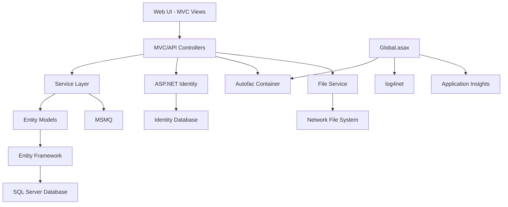
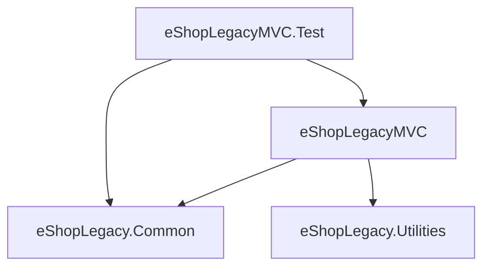
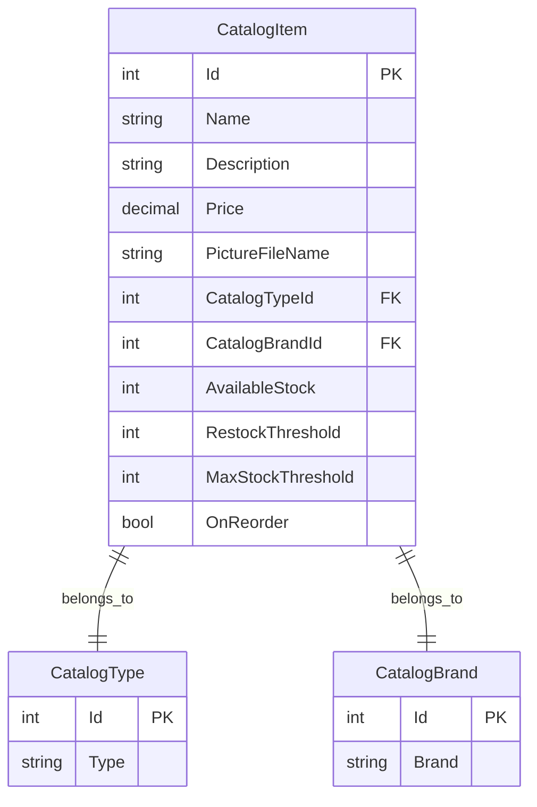

# Technical Architecture Analysis: eShopLegacyMVC

## Executive Summary

The eShopLegacyMVC is a traditional ASP.NET MVC application built on .NET Framework 4.7.2, implementing a catalog management system for an e-commerce platform. The application follows a layered MVC architecture with dependency injection, Entity Framework for data access, and ASP.NET Identity for authentication. The solution consists of four main projects with clear separation of concerns, using Autofac for dependency injection and supporting both mock and real data scenarios.

## Technology Stack

### Core Technologies
- **.NET Framework**: 4.7.2
- **Web Framework**: ASP.NET MVC 5.2.7 + Web API 5.2.7
- **Database**: SQL Server with Entity Framework 6.2.0
- **Authentication**: ASP.NET Identity 2.2.3 with OWIN middleware
- **Dependency Injection**: Autofac 4.9.1

### External Dependencies
- **Logging**: log4net 2.0.8
- **Telemetry**: Application Insights 2.9.1
- **Message Queuing**: System.Messaging (MSMQ)
- **UI Framework**: Bootstrap 4.3.1, jQuery 3.3.1
- **File Processing**: System.IO.Compression
- **Authentication Middleware**: Microsoft.Owin 4.2.2

## Architecture Overview

### High-Level Architecture Diagram

### Architecture Pattern
The application implements a **Layered MVC Architecture** with the following characteristics:
- **Presentation Layer**: MVC Controllers and Views, Web API Controllers
- **Service Layer**: Business logic encapsulation with interface-based design
- **Data Access Layer**: Entity Framework with Code-First approach
- **Cross-Cutting Concerns**: Dependency injection, logging, authentication, and telemetry

## Project Structure

### Solution Organization
1. **eShopLegacyMVC** (Main Web Application)
   - Controllers (MVC and Web API)
   - Views and UI components
   - Models and ViewModels
   - Services and business logic
   - Configuration and startup logic

2. **eShopLegacy.Common** (Shared Models)
   - Core entity models (CatalogItem, CatalogBrand, CatalogType)
   - Shared view models
   - Common utilities

3. **eShopLegacy.Utilities** (Utility Library)
   - Helper classes for serialization
   - Common utility functions

4. **eShopLegacyMVC.Test** (Unit Tests)
   - Controller tests
   - Model tests
   - Service tests

### Dependency Graph

## Data Architecture

### Data Access Patterns
- **ORM**: Entity Framework 6.2.0 with Code-First approach
- **DbContext**: `CatalogDBContext` with fluent API configuration
- **Connection Management**: Named connection strings in Web.config
- **Repository Pattern**: Implemented through service layer abstraction
- **Database Initialization**: Custom initializer with seed data support

### Database Design
- **Primary Database**: CatalogDBContext (Product catalog)
  - Tables: Catalog (items), CatalogBrand, CatalogType
  - Relationships: Foreign key constraints between catalog entities
  - Sequences: Hi-Lo pattern for ID generation

- **Identity Database**: ApplicationDbContext (User management)
  - ASP.NET Identity schema
  - User authentication and authorization data

- **Migration Strategy**: Code-First with custom database initializers
- **Data Seeding**: Support for both hardcoded and CSV-based data loading

### Key Entities and Relationships

## Service Architecture

### Service Layer Organization
- **ICatalogService Interface**: Core business operations abstraction
- **CatalogService**: Real implementation using Entity Framework
- **CatalogServiceMock**: In-memory implementation for testing/development
- **FileService**: File operations with impersonation support
- **Configuration-driven**: Mock vs. real data through AppSettings

### Business Logic Distribution
- **Controllers**: HTTP request handling, model binding, response formatting
- **Services**: Business rules, data validation, entity management
- **Models**: Data structures, validation attributes
- **Infrastructure**: Database initialization, sequence generation

### Service Layer Details
- **CatalogService**: Entity Framework implementation with CRUD operations, pagination support
- **CatalogServiceMock**: In-memory implementation using predefined data for testing/development
- **FileService**: Network file access with Windows authentication and impersonation
- **WeatherService**: External API integration for weather data
- **ApplicationModule**: Autofac module for dependency configuration

### Dependency Injection Patterns
- **Container**: Autofac with module-based registration in ApplicationModule
- **Lifetime Management**: 
  - SingleInstance: Mock services, sequence generators
  - InstancePerLifetimeScope: DbContext, real services, initializers
- **Service Resolution**: Both MVC and Web API dependency resolvers configured
- **Configuration Strategy**: Environment-based service selection (mock vs. real data)

## Cross-Cutting Concerns

### Logging and Monitoring
- **Framework**: log4net with XML configuration
- **Telemetry**: Application Insights integration
- **Request Tracking**: Activity ID correlation using LogicalThreadContext
- **Performance Monitoring**: Built-in Application Insights performance counters

### Security Implementation
- **Authentication**: ASP.NET Identity with cookie-based authentication
- **Authorization**: Controller-level [Authorize] attributes
- **Password Policy**: Configurable strength requirements
- **User Management**: Email-based user accounts with lockout support
- **CSRF Protection**: ValidateAntiForgeryToken attributes

### OWIN Middleware Pipeline
- **OWIN Startup**: Configured in Startup.cs with auth configuration
- **Identity Context**: Per-request ApplicationDbContext and managers
- **Cookie Authentication**: DefaultAuthenticationTypes.ApplicationCookie
- **Security Stamp Validation**: 30-minute validation interval for security
- **Authentication Providers**: CookieAuthenticationProvider with custom validation

### Error Handling
- **Global Filters**: HandleErrorAttribute for unhandled exceptions
- **Custom Error Pages**: Shared/Error.cshtml for user-friendly error display
- **Logging**: Exception logging through log4net
- **Model Validation**: Data annotations with client-side validation

### Error Handling Patterns
- **Controller-Level**: Try-catch blocks in controller actions
- **Service-Level**: Exception propagation from service layer
- **Data Access**: Entity Framework exception handling
- **File Operations**: Windows authentication and file access error handling
- **External Services**: Basic error handling for weather API calls
- **Message Queue**: MSMQ exception handling for message processing

### Configuration Management
- **Sources**: Web.config appSettings, connection strings
- **Environment Configuration**: Web.Debug.config, Web.Release.config transformations
- **Feature Flags**: UseMockData, UseCustomizationData toggles
- **External Dependencies**: File paths, queue paths, API keys configured externally

## Communication Patterns

### Internal Communication
- **MVC Pattern**: Controllers coordinate between Views and Services
- **Service Layer**: Interface-based abstraction for business logic
- **Dependency Injection**: Autofac resolves dependencies at runtime
- **Event Handling**: Standard ASP.NET MVC action-based processing

### External Communication
- **REST API**: Web API controllers for external integration
- **Message Queuing**: MSMQ for asynchronous item creation notifications
- **File System**: Network file access with authentication
- **External Services**: Weather API integration, user lookup services

### API Design and Routing
- **MVC Routing**: Conventional routing with default controller = "Catalog"
- **Web API Routing**: Attribute-based routing and conventional API routes
- **Route Templates**: "api/{controller}/{id}" for Web API endpoints
- **Custom Routes**: Picture serving via "items/{catalogItemId:int}/pic"

### API Controllers and Endpoints
- **BrandsController**: Web API for catalog brand operations (GET, DELETE)
  - GET /api/brands - Returns all catalog brands
  - GET /api/brands/{id} - Returns specific brand by ID
  - DELETE /api/brands/{id} - Deletes brand (demo only)
- **FilesController**: Web API for file operations with binary serialization
  - GET /api/files - Returns serialized brand data in binary format
- **CatalogController2**: Simple API controller for basic JSON responses
  - GET /api - Returns simple "Hello World!" message
- **CatalogController**: MVC controller with comprehensive CRUD operations
  - Paginated catalog browsing, item creation, editing, deletion

### Content Serving and Static Files
- **PicController**: Custom picture serving controller
  - GET /items/{catalogItemId}/pic - Serves product images from file system
  - MIME type detection based on file extensions
  - File path resolution using Server.MapPath
- **DocumentsController**: File upload and download functionality
  - File upload with impersonation support
  - Download with proper MIME type detection
  - File listing capabilities

### Data Transfer and Serialization
- **Binary Serialization**: Custom binary formatter for brand data transfer
- **JSON Serialization**: Standard JSON responses for Web API
- **XML Message Formatting**: MSMQ message serialization using XmlMessageFormatter
- **ViewModels**: Strongly-typed view models for MVC actions

## Performance and Scalability

### Caching Strategies
- **Session State**: In-process session storage for user data
- **Static Content**: Bundling and minification for CSS/JavaScript
- **Database**: Entity Framework change tracking and query optimization
- **ViewBag Caching**: SelectList caching for dropdowns in forms

### Asynchronous Processing
- **Authentication**: Async/await patterns in Identity operations
- **Background Tasks**: Message queue integration for item processing
- **File Operations**: Synchronous file I/O (with async upgrade notes)

### Bundling and Minification
- **JavaScript Bundles**: jQuery, Bootstrap, Modernizr bundles
- **CSS Bundles**: Bootstrap and custom CSS bundling
- **Optimization**: Production-ready bundling configuration

## Testing Architecture

### Test Organization
- **Unit Tests**: MSTest framework with individual component testing
- **Mock Objects**: Moq for service layer mocking
- **Test Isolation**: In-memory DbContext for database-independent testing
- **Controller Testing**: Action result validation and model state testing

### Testing Patterns
- **Service Layer Testing**: Interface-based mocking for ICatalogService
- **Controller Testing**: HTTP context mocking and dependency injection
- **Model Testing**: Entity validation and database context testing
- **File Service Testing**: Mock file system operations and impersonation

## Background Processing

### Message Queue Integration
- **MSMQ Implementation**: System.Messaging for asynchronous communication
- **Message Patterns**: Item creation notifications via XML-formatted messages
- **Queue Configuration**: External queue path configuration in appSettings
- **Error Handling**: Basic message queue error handling patterns

## Refactoring Analysis

### Service Boundary Recommendations

#### Potential Service 1: Catalog Management Service
- **Responsibilities**: Product catalog CRUD operations, inventory management, brand/type management
- **Data Dependencies**: Catalog, CatalogBrand, CatalogType tables
- **External Dependencies**: File storage for product images, MSMQ for notifications
- **Internal APIs**: 
  - GET /api/catalog/items (paginated)
  - POST /api/catalog/items
  - PUT /api/catalog/items/{id}
  - DELETE /api/catalog/items/{id}
  - GET /api/catalog/brands
  - GET /api/catalog/types

#### Potential Service 2: User Management Service
- **Responsibilities**: User authentication, authorization, profile management
- **Data Dependencies**: ASP.NET Identity tables (AspNetUsers, AspNetRoles, etc.)
- **External Dependencies**: External user lookup service
- **Internal APIs**:
  - POST /api/auth/login
  - POST /api/auth/register
  - POST /api/auth/logout
  - GET /api/users/profile

#### Potential Service 3: File Management Service
- **Responsibilities**: File upload, download, storage management
- **Data Dependencies**: File metadata (could be separate database)
- **External Dependencies**: Network file system, authentication credentials
- **Internal APIs**:
  - POST /api/files/upload
  - GET /api/files/{id}
  - DELETE /api/files/{id}
  - GET /api/files/list

### Shared Components
- **Common Models**: CatalogItem, CatalogBrand, CatalogType DTOs
- **Authentication Libraries**: JWT token validation, user context
- **Logging Framework**: Centralized logging infrastructure
- **Configuration Management**: Shared configuration patterns

### Data Partitioning Strategy

#### Database Decomposition Approaches
- **Vertical Partitioning**: 
  - Catalog Service: Catalog-related tables
  - User Service: Identity-related tables
  - File Service: File metadata tables

- **Functional Decomposition**: 
  - Read/Write separation for catalog queries vs. updates
  - CQRS opportunities for complex catalog search scenarios

#### Specific Partitioning Strategies
- **Database-per-Service**: Complete isolation with service-owned schemas
  - Catalog Service: CatalogDB with Catalog, CatalogBrand, CatalogType
  - User Service: IdentityDB with ASP.NET Identity schema
  - File Service: FileDB with file metadata

- **Data Consistency Patterns**:
  - **Strong Consistency**: User authentication operations, inventory updates
  - **Eventual Consistency**: Catalog search indexing, cross-service notifications
  - **Saga Pattern**: User registration with profile setup across services

#### Transaction Boundaries and Consistency
- **Current Transaction Scope**: Entity Framework automatic transaction management
- **Database Transactions**: Single database transactions for catalog operations
- **Cross-Service Transactions**: No distributed transactions currently implemented
- **Compensation Patterns**: Manual rollback handling in exception scenarios

#### Specific Data Consistency Requirements
- **Inventory Management**: Strong consistency for stock levels and reorder flags
- **User Authentication**: Immediate consistency for login/logout operations
- **Catalog Updates**: Strong consistency for item creation, updates, and deletion
- **File Metadata**: Eventual consistency acceptable for file system operations
- **Audit Logging**: Eventual consistency for cross-service audit trails

#### Shared Data Concerns
- **Reference Data**: CatalogBrand and CatalogType lookup tables
- **User Information**: User identity shared across services
- **Audit Data**: Cross-service transaction logging
- **Configuration**: Feature flags and service settings

### Inter-Service Communication Requirements
- **Synchronous APIs**: RESTful HTTP for direct data requests
- **Asynchronous Messaging**: Message queues for event notifications
- **Event-Driven Architecture**: Domain events for catalog changes, user actions

### Migration Complexity Assessment
- **High-Risk Areas**: 
  - Entity Framework relationships across service boundaries
  - ASP.NET Identity integration with custom user properties
  - File system access with impersonation

- **Dependencies Complicating Separation**:
  - Tight coupling between Controllers and multiple services
  - Shared session state across functional areas
  - Global error handling and logging infrastructure

- **Recommended Migration Sequence**:
  1. Extract File Management Service (least dependencies)
  2. Separate User Management Service (clean identity boundary)
  3. Isolate Catalog Management Service (core business logic)

### Infrastructure Considerations

#### Containerization and Orchestration
- **Current Containerization**: Traditional IIS-hosted application
- **Container Readiness**: Requires migration to .NET Core/.NET 5+ for optimal container support
- **Dependencies**: SQL Server, MSMQ, File System access need containerization strategy
- **Resource Requirements**: Session state, file access, and database connections

#### Service Mesh and Communication
- **API Gateway**: Required for routing and cross-cutting concerns
- **Service Discovery**: Needed for dynamic service location
- **Circuit Breaker**: Implement resilience patterns for service dependencies
- **Authentication**: JWT-based service-to-service authentication

#### Deployment and DevOps
- **CI/CD Modifications**: Separate build pipelines for each service
- **Database Migrations**: Independent schema evolution per service
- **Configuration Management**: Externalized configuration for microservices
- **Monitoring**: Distributed tracing and service-specific metrics

#### Current Infrastructure Dependencies
- **IIS Integration**: OWIN pipeline integration with IIS hosting
- **Windows Authentication**: File system access using Windows credentials
- **MSMQ Dependency**: Message queuing tied to Windows Message Queuing
- **Session State**: In-process session management requiring sticky sessions

## Technical Debt and Improvement Opportunities

### Code Quality Issues
- **Tightly Coupled Components**: Controllers directly dependent on multiple services
- **Synchronous File Operations**: FileService uses synchronous I/O operations
- **Global State Dependencies**: Session state usage throughout application
- **Mixed Concerns**: Business logic mixed with presentation logic in controllers

### Architecture Violations
- **Service Location Anti-pattern**: Some services accessed via HttpContext.GetOwinContext()
- **Anemic Domain Models**: Entity models lack business behavior
- **Repository Pattern Absence**: Direct DbContext usage in services
- **Cross-cutting Concerns**: Logging scattered throughout codebase

### Security Concerns
- **File Access**: Windows impersonation for file operations
- **Password Storage**: Default ASP.NET Identity password hashing
- **Session Management**: In-process session state without clustering support
- **Input Validation**: Basic model validation without comprehensive sanitization

### Performance Bottlenecks
- **N+1 Query Problems**: Potential Entity Framework lazy loading issues
- **Large ViewModels**: Heavy object graph serialization in views
- **Synchronous Operations**: Blocking I/O operations in web requests
- **Memory Usage**: In-memory session state and mock data storage

## Recommendations

### Immediate Improvements
- **Async/Await Adoption**: Convert file operations and external service calls to async
- **Repository Pattern**: Implement repository abstraction over Entity Framework
- **Centralized Logging**: Consolidate logging infrastructure with structured logging
- **Configuration Externalization**: Move hardcoded configuration to external sources

### Long-term Refactoring Strategy
- **Domain-Driven Design**: Introduce rich domain models with business logic
- **CQRS Implementation**: Separate command and query operations for better scalability
- **Event-Driven Architecture**: Replace direct method calls with domain events
- **Microservices Decomposition**: Extract bounded contexts into separate services

### Migration Pathway
1. **Phase 1**: Extract cross-cutting concerns (logging, configuration, validation)
2. **Phase 2**: Implement repository pattern and unit of work
3. **Phase 3**: Introduce domain events and CQRS patterns
4. **Phase 4**: Extract microservices based on bounded contexts
5. **Phase 5**: Implement distributed caching and messaging

### Risk Mitigation
- **Incremental Refactoring**: Small, iterative changes to reduce deployment risk
- **Feature Toggles**: Use feature flags for gradual rollout of new architecture
- **Comprehensive Testing**: Maintain high test coverage during refactoring
- **Performance Monitoring**: Implement APM tools to track system performance

## Technical Architecture Summary

### Strengths
- **Clear Separation**: Well-defined project boundaries and responsibilities
- **Dependency Injection**: Proper IoC container usage with Autofac
- **Testability**: Mock implementations and unit test coverage
- **Configuration Management**: Environment-specific configuration support

### Areas for Improvement
- **Async Patterns**: Limited async/await usage for I/O operations
- **Domain Logic**: Business logic scattered across service and controller layers
- **Scalability**: In-process state management limits horizontal scaling
- **Security**: Basic security implementations without advanced patterns

### Technology Modernization Opportunities
- **.NET Framework to .NET Core**: Migration for cross-platform support and performance
- **Entity Framework Core**: Upgrade for improved performance and features
- **Docker Containerization**: Container-ready deployment for cloud environments
- **Cloud-Native Patterns**: Implement cloud-first architectural patterns

## Migration Recommendations

### Phase 1: Service Extraction (File Management)
- Extract FileService as standalone Web API
- Implement HTTP-based file operations
- Maintain existing file system integration
- Add service authentication

### Phase 2: User Management Separation
- Extract ASP.NET Identity to dedicated service
- Implement JWT token-based authentication
- Create user management APIs
- Migrate external user lookup integration

### Phase 3: Catalog Service Isolation
- Separate catalog operations to microservice
- Implement event-driven communication for catalog changes
- Add CQRS pattern for read/write separation
- Integrate with message queuing for notifications

### Phase 4: Infrastructure Modernization
- Migrate to .NET Core/.NET 5+
- Implement containerization with Docker
- Add service mesh capabilities
- Implement distributed logging and monitoring
